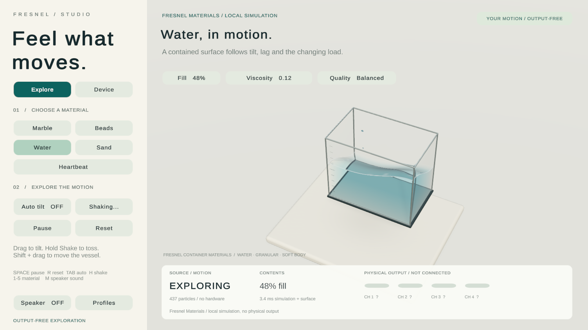

# Fresnel Studio / Unity

A handheld-container presentation client and interactive material studies,
targeting **Unity 6.3 LTS / 6000.3.23f1**, with the Built-in render pipeline.
Explore a marble, 24 beads, water, retained sand and a fictional heartbeat.
Water, sand and soft material now use the original, reusable
[Fresnel Container Materials package](FresnelContainerDemo/Packages/com.fresnel.container-materials/README.md).
Device mode connects directly to StampC5 over USB and presents the state owned
by AtomS3.

The current verification and physical limitations are recorded once in
[16](../docs/16_PROGRESS_STATUS.md#optional-unity-study--2026-09-10).
The remaining attended acceptance belongs in
[08](../docs/08_IMPLEMENTATION_PLAN.md#unity-implementation-track).

## Run

- Download ready-to-run files from the
  [Unity v0.3.0 experimental release](https://github.com/hatodove22/FresnelInertia/releases/tag/unity-v0.3.0).
  Release files are separate from Git source history; build/cache folders are local.
- Windows: open `FresnelContainerDemo/Builds/Windows/FresnelContainerDemo.exe`.
  Distribute the whole Windows folder together, or its ZIP, including the data
  directory and DLLs. The executable alone is insufficient.
- Android: install a freshly built `FresnelContainerDemo/Builds/Android/FresnelContainerDemo.apk`
  on an ARM64 Android 7.1+ device. The Unity 6 build has a minimum API level of 25.
  This is a development APK for direct installation, not a store release. It
  uses the ordinary landscape screen.

Both start in **Explore**, with speaker audio muted. Connection and preset
selection never implicitly start physical output.

Published distribution artifacts (local builds use the same filenames):

- [Complete Windows ZIP](https://github.com/hatodove22/FresnelInertia/releases/download/unity-v0.3.0/FresnelStudio-Windows.zip)
- [Android development APK](https://github.com/hatodove22/FresnelInertia/releases/download/unity-v0.3.0/FresnelContainerDemo.apk)
- [Reusable UPM package](https://github.com/hatodove22/FresnelInertia/releases/download/unity-v0.3.0/com.fresnel.container-materials-0.3.0.tgz)
- [24-second motion demonstration](https://github.com/hatodove22/FresnelInertia/releases/download/unity-v0.3.0/Fresnel-Motion.mp4)
- [SHA-256 checksums](https://github.com/hatodove22/FresnelInertia/releases/download/unity-v0.3.0/SHA256SUMS.txt)

The UPM archive contains the package source, shaders, MIT license and independent
sample builder. Select **Install package from tarball** in Unity's Package
Manager to import it into another Built-in pipeline project.



The image and release film are real player captures. The portable
[v0.3.0 verification records](verification/results/v0.3.0/) retain assertion
results and capture-free timings; path labels are normalized for publication.

## Explore

The original marble/beads tray uses Unity PhysX. Collisions, the center-of-mass
marker and two illustrative contact planes share that simulation. Scene units
and plane angles are illustrative. Twenty-four spheres are a separate study,
not the production retained-sand model.

Water uses a particle density solver and a smooth, connected free surface fitted
to its aggregate motion. Refraction, depth-dependent absorption and studio
reflections make the liquid depth visible. Sand uses frictional particle contacts
and a continuous fine-grained bed reconstructed from their mass distribution.
The fictional heartbeat uses elastic bonds, shape matching and a smooth bound
skin driven by a source-owned contraction envelope. These run inside the metric cutaway
and respond to local tilt, translation and rotation in Explore. Water adds damped
spatial waves, contained droplets and contact foam from accepted motion. Sand
separates the supported bed from actual airborne particles and settles back into
one deposit. The optical surface and individual
particles are approximations; they are not a port of the production C++
synthesis model, CFD measurements or tracked real grains. The heartbeat has
no biometric input.

On a supported desktop, Balanced/High water uses a GPU implicit field and
raymarched surface for a smoother silhouette. Mobile quality and Android use
the CPU mesh fallback. Both hold their actual geometry when source motion
stops; the CPU timing shown in the HUD does not measure GPU execution time.

| Control | Action |
|---|---|
| Scene drag / single-finger swipe | Set tilt; releases at the chosen angle |
| Hold to shake / H held | Repeated compound shaking for water, sand and soft material; release to settle |
| Shift + scene drag | Translate the gallery vessel; acceleration follows the displayed motion |
| Arrow keys / WASD | Change pitch and roll |
| Tab / Auto tilt | Toggle automatic motion |
| 1-5 / material buttons | Marble, beads, water, sand, heartbeat |
| Space / Pause | Pause/resume offline motion; **Stop** in Device mode |
| R / Reset | Reset offline state; read applied state in Device mode |
| M / Speaker | Toggle optional authored speaker sound |
| Escape | Quit; attempt acknowledged Stop before orderly connected exit |
| Fill | Cycle 25%, 50% and 75% in the material gallery; reseeds content |
| Viscosity / Friction / Softness | Cycle the selected material's normalized response |
| Quality | Cycle Mobile, Balanced and High numerical/rendering budgets; reseeds content |

The last three controls belong to offline material exploration and do not
change device parameters. Desktop starts at Balanced quality; Android selects
Mobile. The package also supports empty and near-full containers through its
API. Fill changes are explicit reseeds, not a pouring interaction. The
container stays closed, including when tilted; there is no spill-out model.

## Haptic Link

1. Disconnect the Web client from the receiver so one client owns the USB port.
2. Choose **Device**, attach StampC5, then **Scan**. On Windows, Scan cycles the
   available COM names, including non-USB serial ports; choose the receiver's
   actual port or type its name. On Android it lists supported Espressif CDC USB
   endpoints. Press **Connect** and grant Android's USB permission if prompted.
3. Connection reads status and applied state. It sends no preset or Start.
   Choose a material explicitly; its transaction stops, loads and confirms.
4. Once fresh applied state is Idle, **Start** requests Live, audio and tilt in
   order. Each step needs an AtomS3 execution ACK; partial failure attempts Stop.
5. **Stop** remains reachable, including while the profile panel is open.
   **Servo recheck** performs a stopped recovery request. Read the actual state,
   fault and feedback indicators before interpreting the mechanism's response.

The gallery uses resolved metric dimensions and the model's body X/Y cross-section
(Unity local X/Y/-Z). Device mode disables the independent PhysX tray and local
tilt/shake controls. Its particle detail advances only with accepted source time and
follows reported gravity, gravity-excluded acceleration, velocity, energy, events
and aggregate centre. The accepted orientation supplies local angular velocity.
Missing/invalid IMU acceleration does not replay an earlier acceleration. The
amber centre marker is taken directly from telemetry; a bounded visual solver
can retain an aggregate-following residual, which is not a new measured state.
Four meters show reported actuator levels, not reconstructed wall contacts.
Brass and teal shaft plates show reported goal and valid position
relative to servo home; they are not calibrated fingertip angles or forces.
Absent, invalid or older-than-250-ms servo readback is unknown. Lost telemetry
holds the picture and suppresses source-driven sound; it never falls back to
an automatically moving preview.

Disconnect and app pause attempt Stop, then close the session. A failed ACK,
unplug or process termination cannot establish that physical outputs are off.
Resume/reconnect reads state and never replays Start. USB permission waiting is
cancelled by Stop without opening a later, abandoned session.

## Profiles A / B

Open **Profiles**, choose slot A or B, paste the selected-profile JSON exported
by Web tuning and **Save slot**. **Copy JSON** exports that slot. Local storage
is under Unity's `Application.persistentDataPath/Profiles`; Windows normally
uses `AppData/LocalLow/Fresnel Inertia/Fresnel - A little inertia/Profiles`.

**Apply slot** accepts the same representative material as the fresh device
state. It stops, probes the firmware capability, loads the preset, sets all
seven values and checks four numeric `tilt_v1` readbacks. Gain and the two
material values have execution ACKs only. Start remains a separate action.
Stop cancels the remaining transaction.

**Baseline JSON** prepares a shipped baseline for inspection. **Use baseline**
applies that material's shipped settings while stopped. This is an explicitly
chosen software baseline, not a complete backup reconstructed from telemetry.
A locally selected slot and the last successfully applied slot are different
states. Profiles preserve source/review metadata and never invent A/B votes;
zero-comparison baselines remain rehearsal-only. Preference optimization stays
in the existing Web workspace.

## Build and verify

Open `FresnelContainerDemo` in Unity 6000.3.23f1 and load
`Assets/Scenes/ContainerStudy.unity`, or run these commands from this `unity/`
directory:

```powershell
./Build-Demo.ps1
./Verify-Demo.ps1 -Visible
./Verify-Studio.ps1 -Visible
./Verify-Materials.ps1 -Visible
./Verify-Visuals.ps1 -Visible
./Verify-Visuals.ps1 -Visible -Uncapped
./Build-Android.ps1
./Package-Distribution.ps1
```

The build scripts and Editor regression default to
`%LOCALAPPDATA%/Unity/Editors/6000.3.23f1/Editor/Unity.exe`.
Pass `-EditorPath` to the build scripts or `Verify-Studio.ps1` if your Unity 6.3
Editor is installed elsewhere. The package is embedded at
`FresnelContainerDemo/Packages/com.fresnel.container-materials`; a separate asset
purchase or package download is not required.

On a fresh checkout, run **Build-Demo.ps1 first**, including before an Android
build. It restores TMP essential assets from the installed uGUI package. In the
Editor, the equivalent is Window → TextMeshPro → Import TMP Essential Resources.
Generated TMP assets and their original font/sprite notices stay local; Unity
supplies them under its package terms. Keep the checked-in package lock file.

`Package-Distribution.ps1` requires Node/npm and Python 3.10+. It creates the
UPM tarball, verifies every archived package byte, bundles the full Windows
player with CRC/content checks and writes `Builds/SHA256SUMS.txt`. If present,
the Android APK and film are included in the checksum list. The package has
its own MIT license; that does not apply to Unity runtime binaries or relicense
the rest of this repository.

The standalone protocol/schema helper is `./verification/link/run.ps1`.
First run `npm ci` in `../webxr/` to restore its locked Node validation dependencies.
The helper uses Unity's Mono tools and the resolved Newtonsoft package; no port
or physical device is opened.

`Build-Demo.ps1` generates the bootstrap scene through Editor APIs, imports TMP
resources on a fresh project and builds Windows x64. `Build-Android.ps1` selects
Android before compiling, uses IL2CPP/ARM64 and creates a development APK.
It clears only the generated Gradle APK before packaging so incremental ZIP
updates cannot retain unused space; compiled Gradle and IL2CPP caches remain.
`-IncludeArmV7` optionally adds ARMv7. Install Android Build Support and its
SDK/NDK and OpenJDK modules for the same Unity Editor. The builder uses that
Editor's embedded OpenJDK 17, NDK r27 and SDK platform 35 or newer; Unity 6.3's
recommended NDK is r27c. Target SDK is selected automatically from the installed
SDK, and the USB library inherits Unity's compile/minimum SDK and build-tools
settings. An explicit compatible `AndroidPlayer` root can be supplied with
`-AndroidToolsPath`. It does not search old Editors for a substitute toolchain.
No firmware, Web bundle or device storage is changed.

`Verify-Demo` retains the original PhysX regression. `Verify-Studio` runs the
C# protocol, presentation and profile suites, then the actual player with an
explicit `--studio-test` mock bridge. That bridge never opens hardware and is
visibly labeled MOCK. `-PlayerOnly` skips the Editor suite when only runtime UI
has changed. Tests capture gallery, profile, link, stale, compact and wide views.
Use `-Visible` for screenshots: hidden Windows players can have black backbuffers.

`Verify-Materials` runs the actual player with `--materials-test`: water/sand/
softbody geometry, shader availability, fill/response/quality controls,
opposite extreme tilts, duplicate/invalid source rejection, source hold and
mock device recovery. It writes separate screenshots, assertion results and
warm timing samples under `output/unity/materials/<UTC timestamp>/`, relative
to the repository root. `output/unity/materials-latest.txt` points to the
latest run. `SimulationMs` and `SurfaceMs` measure CPU work; reported wall-frame
distributions include VSync and frame scheduling. Running the script produces
evidence; the current pass/fail results belong in document 16.

`Verify-Visuals` captures settled and tilted water, sand and soft material at
Balanced and Mobile quality. The normal run checks the actual 60 Hz presentation;
`-Uncapped` disables VSync and fixes each simulation step to 1/60 second to measure
work without the normal frame cap. Whole-frame GPU timings come from Unity's
FrameTimingManager and include the scene/UI; they are not individual water-stage
timings. VSync results can include driver/present waiting. A missing allocation
counter stays unavailable, and Mobile quality on Windows is not a phone benchmark.

`./Verify-Shake.ps1 -Visible` exercises 3 Hz translation, 5 Hz translation with
rapid rotation, Pause and four seconds of release for all three materials at
Balanced/Mobile quality. It checks containment, source acceleration and the
held dynamic-state fingerprint, and captures bursts, release and settling under
`output/unity/shake-review/`. Use `-NoCapture` for timing without screenshot
overhead; add `-Uncapped` to measure workload independently of the frame limiter.
The scripted run uses fixed accepted 1/60-second intervals and never opens hardware.

`./Record-Motion.ps1 -Visible` records the actual player at 30 fps: water, sand
and soft material each show one second at rest, three seconds shaking and four
seconds after release. It saves raw PNGs/source-time CSV under `output/unity/motion-film/`
and uses the installed FFmpeg to encode `Builds/Fresnel-Motion.mp4`. The 720-frame,
24-second output is verified with ffprobe. Recording overhead is excluded from
performance measurements; this film does not establish sustained frame rate.

The local material solver consumes at most 1/60 second per accepted frame,
using up to two substeps. Overload skips visual-detail time while accepting
the latest source state. Its consumed/skipped interval counters make that
tradeoff visible; they do not imply that phone performance has been measured.

For the cross-language profile roundtrip, run this after the Editor suite,
using the output directory printed as `Web roundtrip directory` in its log:

```powershell
node FresnelContainerDemo/Assets/Scripts/Profiles/Fixtures/verify-web-roundtrip.mjs '<roundtrip-directory>'
```

`verification/link/run.ps1` independently compiles/runs the protocol suite and
validates emitted mock snapshots against the repository's JSON schema.
Generated evidence is under the ignored `output/unity/`; builds, caches and
logs stay out of Git. Mock tests, desktop timing and APK compilation do not
establish actual USB, simultaneous tactile output or Android performance.

## Implementation

- `StudioApp`: source selection, command lifecycle and profile application.
- `ContainerDemo`: preserved offline PhysX tray and illustrative plane cues.
- `Link`: mixed-line protocol, execution ACK queue, Windows and Android transports.
- `Presentation`: sample-time adapter, legacy reduced presentation and optional audio.
- `GalleryScene` / `DemoHud`: metric cutaway, servo readbacks and Canvas UI.
- `Packages/com.fresnel.container-materials`: original MIT-licensed particle
  solvers, surface reconstruction, optical shaders and standalone sample.
- `Profiles`: strict Web-compatible JSON and local A/B persistence.
- `Plugins/Android/FresnelUsb.androidlib`: USB host permission and CDC bridge.
- `Editor`: reproducible scene, dependency setup, regression and builds.

Audio is procedurally authored in this project; no recorded biological audio
or downloaded media is included. Existing Web/Android clients and the
Mass Motion -> Event -> Texture -> Resonance -> Spatial4 firmware architecture
remain unchanged.

The material package uses public PBF/XPBD research ideas; it includes no Obi
code or paid assets. Its small closed-vessel scope and current rendering limits
are documented in the package README. Comparable appearance is a visual target,
not an independently established equivalence to Obi or a complete replacement
for its feature set.
